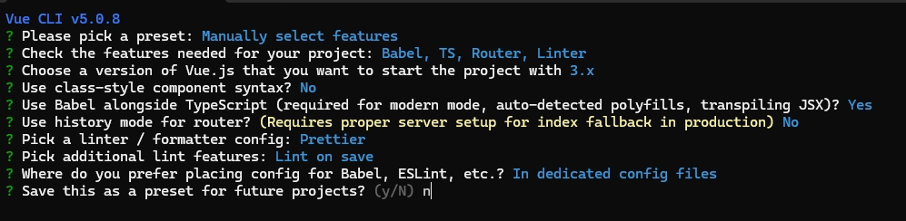
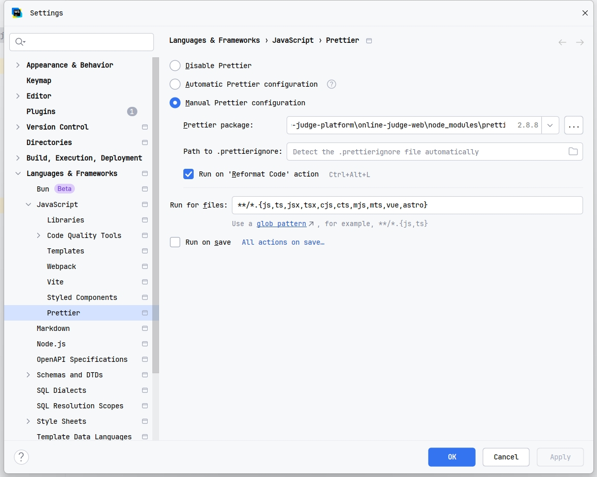

1. 初始化ant-design-vue 项目

官方文档：[Ant Design Vue](https://2x.antdv.com/docs/vue/getting-started-cn)

```
安装脚手架
npm install -g @vue/cli

vue create online-judge-web
```

初始化过程选择：



用webstorm打开，配置代码美化



**代码美化会自动报错，按住ctrl+alt+L就可以自动修正**

2. 安装组件库

```
npm install --save-dev @arco-design/web-vue
```

修改main.ts

```
import { createApp } from "vue";
import App from "./App.vue";
import ArcoVue from "@arco-design/web-vue";
import "@arco-design/web-vue/dist/arco.css";
import router from "./router";
import store from "./store";

createApp(App).use(ArcoVue).use(store).use(router).mount("#app");
```

3. 安装axios

官网：[Axios中文文档 | Axios中文网](https://www.axios-http.cn/)

```
npm install axios
```

